# Architecture diagrams

Every diagram here is derived from the code on `main`, not from a design document. Names in
the diagrams are the names in the source: Go functions and types, Redis key and channel
names, HTTP routes, WebSocket event types. Every source path quoted below
(`server/bus.go`, `web/src/api.js`, and so on) is relative to the repository root.

Each `.mmd` file is also rendered to an `.svg` next to it. To re-render after an edit,
from this folder:

```bash
mmdc -i system.mmd -o system.svg
```

The Mermaid block under each heading is a copy of the matching `.mmd` file — editing one
means editing the other. The diagrams carry identifiers only; the reasoning behind each
step is in the **Reading it** list under the diagram, keyed by the label the step carries
in the diagram rather than by its number — numbers shift whenever a step is added.

## How multi-server delivery works

The backend runs as **two instances of the same binary** (`docker-compose.yml`,
`deploy.replicas: 2`, published on host ports 8080 and 8081). There is deliberately
**no load balancer**: the compose file says a round-robin proxy would hide which node
answered, and seeing that is the point of running two.

Each instance holds its own `Hub` — two maps, `byChannel` and `byUser`, under one mutex —
which knows only about the WebSocket sockets **open on that process**. Nothing about the
hub is shared. What ties the instances together is Redis, in two distinct roles.

### 1. Redis Pub/Sub as the fan-out bus

`server/bus.go`. Three kinds of topic:

| Topic | Payload | Subscribed |
|---|---|---|
| `ch:{channelID}` | a stored `Message` as JSON, or `typingEvent` / `presenceEvent` / `profileEvent`, told apart by a `type` field a message never has | dynamically, while this node has at least one local socket reading that channel |
| `session-revoked` | a session `ObjectID` hex — never the token | permanently, from `newBus` |
| `subscription` | `subscriptionChange{user_id, channel_id, subscribed}` | permanently, from `newBus` |

The delivery path is always the same, and it always goes through Redis — even when
sender and recipient are on the same instance:

```
handler → bus.Publish(chID, payload) → Redis PUBLISH ch:{chID}
        → every subscribed instance's bus.Run → Hub.Publish → Subscriber.send → writePump → browser
```

Publishing to Redis rather than short-cutting to the local hub buys two things, both
stated in `bus.go`: every node sees messages in one order, and no node has to recognise
and filter the echo of its own event. The sender's own socket receives its message back
like everyone else's; the client ignores it because `client_msg_id` is already in the feed.

A node subscribes to `ch:{id}` only while somebody connected *there* reads that channel.
`Hub.attach` calls `watch` on the first local reader, `Hub.drop` and `Hub.Unsubscribe`
call `unwatch` on the last one. Those run under the hub's mutex and must never block, so
they only record the channel in `bus.pending` — a **set**, `map[string]bool`, plus a
one-slot `wake` channel — and `bus.Run` drains the whole set in `applyWatches` with one
`SUBSCRIBE` and one `UNSUBSCRIBE`.

It used to be a 256-slot queue, and that was a real hole (#23). `watch` fires only on the
transition into `byChannel`, so a note dropped on overflow was never reissued and the node
went deaf on that channel for as long as any local reader stayed. `Connect` enqueues one
note per channel synchronously under the mutex while the consumer paid a round trip each,
so the buffer had to hold the entire burst. Measured against a live Redis: four sockets of
200 channels each left **373 of 800 channels without a `SUBSCRIBE`**. A restart is exactly
what produces it — every client reconnects at once against a cold node. The set collapses
repeats, so it is bounded by the node's own channels and nothing is dropped.

**The bus is the fast path, never the guarantee.** A message is written to MongoDB
*before* it is announced (`deliverMessage`). If no node is subscribed, or Redis is down,
the event is lost and the message is still in the database — the client recovers it with
`GET /messages` on the next reconnect (`backfill()` in `Messenger.vue`).

### 2. Redis as the presence store

`server/presence.go`. Separate mechanism, its own keys, no Pub/Sub:

| Key | Type | Meaning |
|---|---|---|
| `presence:sockets:{userID}` | SET of `{nodeID}:{socketID}` | the user's open sockets — the node is embedded in the member, so this set also says *where* they are |
| `presence:node:{nodeID}` | SET of `{userID}:{nodeID}:{socketID}` | the same pairs indexed by node, so a dead node's sockets can be found |
| `presence:version:{userID}` | counter (`INCR`) | events about one user come from different nodes and Pub/Sub keeps no order between publishers, so the version says which is newer |
| `presence:alive:{nodeID}` | string, 30 s TTL | a node's pulse, rewritten every 10 s |
| `presence:nodes` | SET | the registry to look for a missing pulse in |
| `presence:sweeper` | `SETNX`, 10 s TTL | held for one round by the node cleaning up after the dead ones |
| `presence:epoch` | `SETNX` unix millis | a version means something only within one life of Redis — the epoch says which life |

A user is online while they hold a socket on a node that is still beating. `onlineIn`
ignores sockets belonging to nodes whose pulse has expired, so a read is correct as soon
as the pulse dies, without waiting for the sweep. When a node dies for real, one surviving
node wins `presence:sweeper`, claims the dead node with `SREM presence:nodes` (Redis is
single-threaded, so exactly one caller sees it removed), and closes its orphaned sockets
the way their own node would have.

### What Redis is not used for

Sessions live in MongoDB with a per-process in-memory cache — Redis only carries the
invalidation. There is no rate limiting in Redis (the typing limits are counters on the
connection struct), and no cache of MongoDB documents. This is a rule rather than an accident:
nothing durable goes into Redis, which runs with `--save '' --appendonly no`.

---

## system.mmd

The whole system: the Vue client, the two Go instances, Redis and MongoDB, showing which
traffic is HTTP, which is WebSocket, and which goes through Redis. There is no proxy in
the picture because there is none in the deployment.

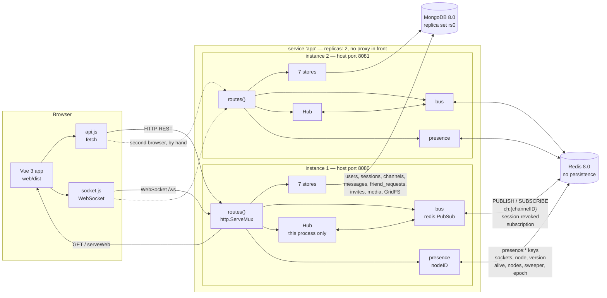

**Reading it**

- The Go process serves the built frontend itself: `GET /` falls through to `serveWeb`,
  which returns `web/dist/index.html` for any path that is not a file on disk, because
  `/invite/{code}` is a client-side route.
- The dashed edges to instance 2 are dashed for a reason: nothing routes a client there.
  A second browser is pointed at `http://localhost:8081` by hand. In dev, Vite proxies
  everything to `:8080` only (`web/vite.config.js`).
- Both instances talk to the same `redis.Client` config; `presence` is constructed with
  `bus.rdb`, so the bus and the presence store share one connection pool.
- `GET /health` pings MongoDB and nothing else, so a node whose Redis is gone — no
  fan-out, no presence — still reports `{"status":"ok"}`.

**Based on:** `docker-compose.yml`, `Dockerfile`, `server/main.go`, `server/server.go`, `server/bus.go`, `server/presence.go`, `server/health.go`, `web/src/api.js`, `web/src/socket.js`, `web/vite.config.js`

---

## backend-architecture.mmd

Inside one Go instance, grouped by layer: entry and middleware, HTTP handlers, the
WebSocket hub and the Redis bus, the two services, the seven stores, and the two adapters.

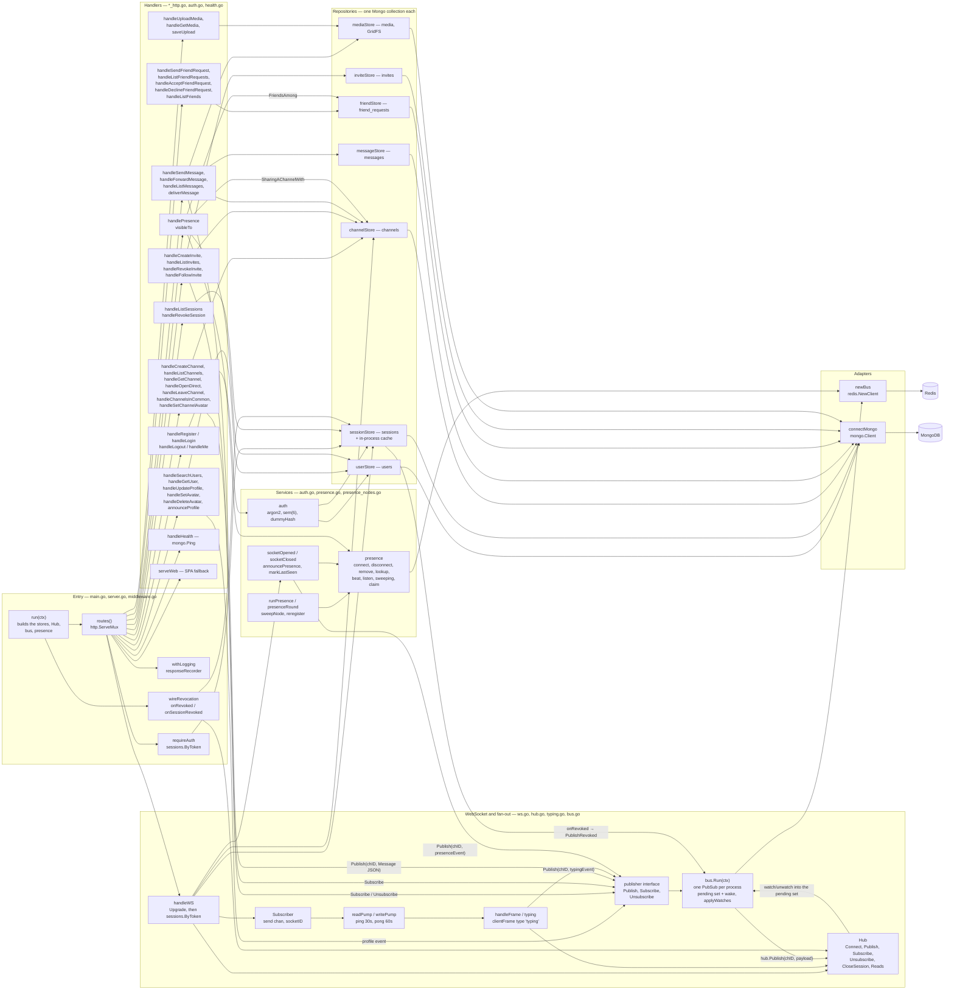

**Reading it**

- **`publisher` is the only broadcast seam.** Every handler that announces anything calls
  `Publish` / `Subscribe` / `Unsubscribe` on that interface, never `Hub` directly.
  That is an invariant (`docs/architecture.md`), and it is why swapping single-instance
  fan-out for the Redis bus touched one file.
- `*bus` and `*Hub` both satisfy `publisher`. Tests use `*Hub`, which reaches this process
  only, so they need neither Redis nor a second instance.
- `requireAuth` wraps every route except `GET /health`, `GET /ws` and `GET /`. `/ws` is
  outside on purpose — see `seq-ws-connect.mmd`.
- The layering here is by file, not by package: there is only one package (see
  `packages.mmd`).
- `handlePresence` is the only handler that reaches into two stores purely to answer
  "may this caller ask?" — `visibleTo` unions `channelStore.SharingAChannelWith` and
  `friendStore.FriendsAmong` before anything is read from Redis.

**Based on:** `server/main.go`, `server.go`, `middleware.go`, `auth.go`, `ws.go`, `hub.go`, `bus.go`, `typing.go`, `presence.go`, `presence_nodes.go`, `*_http.go`, `users.go`, `sessions.go`, `channels.go`, `messages.go`, `friends.go`, `invites.go`, `media.go`, `mongo.go`, `health.go`

---

## packages.mmd

Internal Go package dependencies. There is exactly one internal package — every file
under `server/` is `package main` — so there are no internal edges to draw, and the
diagram shows that plus the external modules it imports.

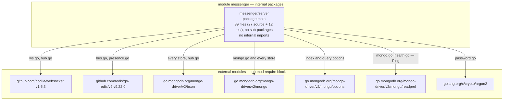

**Reading it**

- This is a finding, not a simplification: `go list ./...` returns the single line
  `messenger/server`. 39 files, 27 source and 12 test, no sub-packages.
- It is also deliberate: the package layout is not designed up front, a file is split off
  only when the cut becomes obvious.
- The layering a package graph would normally show lives in `backend-architecture.mmd`.
- `goda` is not installed on this machine; it would produce the same single node.

**Based on:** `go list ./...`, `go list -f '{{.Imports}}' ./...`, `go.mod`

---

## frontend.mmd

The Vue app: views and components, the client modules, and the backend surface each one
touches. There is **no vue-router and no pinia** — `views/Messenger.vue` is both the
router and the store.

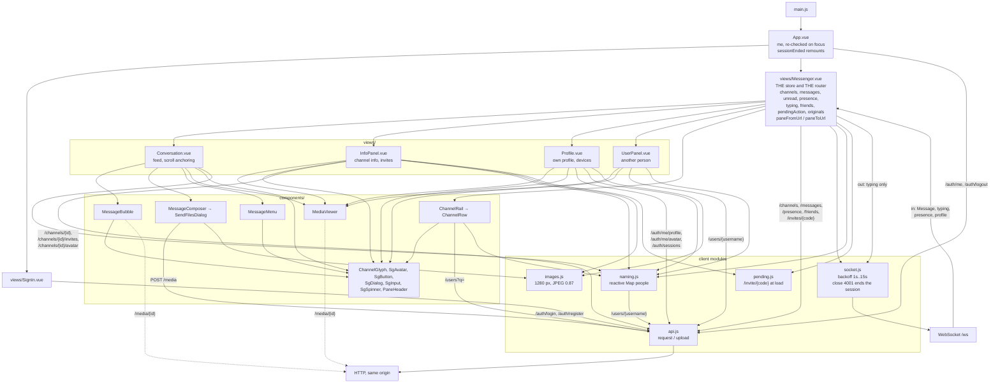

**Reading it**

- Routing is `paneFromUrl` / `paneToUrl` plus `history.replaceState` (not `pushState`,
  so switching chats does not pile up back-button entries). The paths are `/c/{id}`,
  `/c/{id}/info`, `/c/{id}/u/{username}`, `/u/{username}` and `/profile`. The prefix is
  `/c/` and not `/channels/` because `GET /channels/{id}` is an API route the dev proxy
  would answer with JSON.
- `/invite/{code}` is handled separately in `pending.js`, at module-evaluation time,
  before `createApp` — the code is stashed and the URL rewritten to `/`, because whoever
  followed the link may still have to sign in.
- State is `ref`s inside `Messenger.vue` plus one module-level `reactive(new Map())` in
  `naming.js`, which caches display names and avatars per session. Documents embed the
  username only, so the display name has to be looked up and kept current — which is what
  the `profile` WebSocket event is for.
- `GET /users/{username}` and `GET /users?q=` no longer return `last_seen_at` (#24);
  `GET /presence` is the only place that answers it, and only about people the caller
  meets somewhere.
- The socket carries four inbound shapes. Three have a `type` field (`typing`,
  `presence`, `profile`); a stored `Message` has none, and that is how `receive()` tells
  them apart. Outbound there is exactly one: `{type: 'typing', channel_id}`.

Which module calls what:

| Module | `api.js` calls |
|---|---|
| `App.vue` | `me`, `logout` |
| `views/SignIn.vue` | `login`, `register`, `me` |
| `views/Messenger.vue` | `channels`, `createChannel`, `openDirect`, `leaveChannel`, `followInvite`, `messages`, `messagesByIds`, `send`, `forward`, `presence`, `friends`, `friendRequests`, `sendFriendRequest`, `acceptFriendRequest`, `declineFriendRequest` |
| `views/InfoPanel.vue` | `channel`, `channelsInCommon`, `invites`, `createInvite`, `revokeInvite`, `setChannelAvatar`, `removeChannelAvatar`, `user` |
| `views/Profile.vue` | `updateProfile`, `setAvatar`, `removeAvatar`, `sessions`, `revokeSession` |
| `views/UserPanel.vue` | `user`, `channelsInCommon` |
| `components/ChannelRail.vue` | `searchUsers` |
| `components/MessageComposer.vue` | `uploadMedia` |
| `naming.js` | `user` |

**Based on:** `web/src/main.js`, `App.vue`, `api.js`, `socket.js`, `naming.js`, `pending.js`, `images.js`, `views/*.vue`, `components/*.vue`, `web/vite.config.js`

---

## data-model.mmd

The persisted structs with their MongoDB collection, the runtime structs that carry
cluster state, the JSON events that travel Pub/Sub, and the Redis keys.

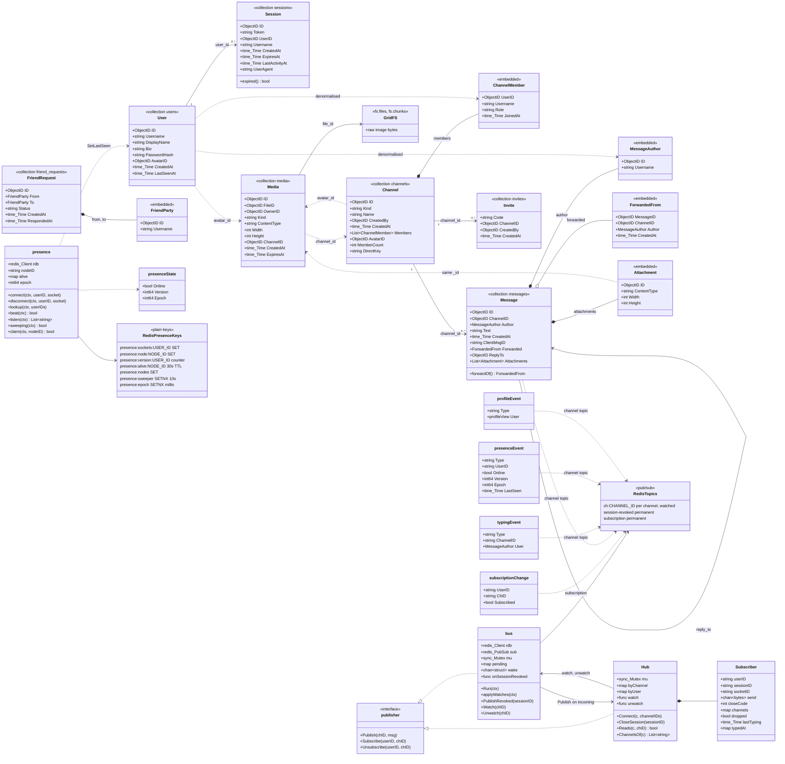

**Reading it**

Mermaid rejects `{` inside a class member, so the diagram writes `ch:CHANNEL_ID` and
`presence:sockets:USER_ID` where the code uses `ch:{channelID}` and
`presence:sockets:{userID}`. The exact forms are in the two tables above.

Indexes, from the `ensureIndexes` method of each store:

| Collection | Indexes |
|---|---|
| `users` | unique `username` |
| `sessions` | unique `token`; TTL on `expires_at` (`expireAfterSeconds: 0`); `user_id + _id` |
| `channels` | `members.user_id + _id` (multikey); unique sparse `direct_key` |
| `messages` | `channel_id + _id`; unique `channel_id + client_msg_id`, partial on `client_msg_id` existing |
| `friend_requests` | `to.id + status + _id`; `from.id + status + _id`; unique `from.id + to.id`, partial on `status: 'pending'` |
| `invites` | `channel_id + created_at desc`; the code is `_id`, so uniqueness is free |
| `media` | partial on `expires_at`; `channel_id`; `file_id` |

- **Denormalisation is one-directional.** `ChannelMember`, `MessageAuthor` and
  `FriendParty` embed `username`, which never changes, and never `display_name` or
  `avatar_id`, which do. That is the whole reason the `profile` event exists.
- `Channel.DirectKey` is the sorted pair `"userA:userB"`, which turns "the conversation
  between these two" into a value the unique index can enforce. A direct channel can
  therefore never gain a third member — `AddMember` filters on `kind: 'channel'`.
- `Message.Forwarded` is a snapshot, not a reference, so a forward survives its source
  channel being discarded, and `forwardOf()` keeps chains from nesting.
- `Message.ReplyTo` is only an id: the quote is filled in by the client, so an edited
  original would show its current text.
- `Message.ClientMsgID` is unique **within its channel**, not globally (#26). It used to
  be a global unique index, which made the sender's retry key also a read key: posting
  with an id somebody else had used failed the insert, fell into the duplicate branch and
  answered with *their* message — text, author and channel id — to someone not in that
  channel. The index is partial rather than sparse because a sparse compound index takes
  any document holding one of its keys, and every message has a `channel_id`, so messages
  sent without a `client_msg_id` would all index as `{channel, null}` and the second one
  in a channel would be refused.
- `User.LastSeenAt` is `json:"-"` (#24). It used to leak through `GET /users/{username}`
  and through search, which hand back `User` itself. The profile stays public so a
  stranger can be found and befriended at all; state is not part of the profile and is
  answered only by `GET /presence`.
- `Media` and `GridFS` are separate on purpose. A forwarded picture is a second `media`
  record over the same `FileID`, which is why `DeleteUnreferencedFiles` counts references
  before deleting bytes.

**Based on:** `server/users.go`, `sessions.go`, `channels.go`, `messages.go`, `friends.go`, `invites.go`, `media.go`, `hub.go`, `bus.go`, `presence.go`, `typing.go`, `users_http.go`

---

## seq-login.mmd

Login: `POST /auth/login` through to the session cookie.

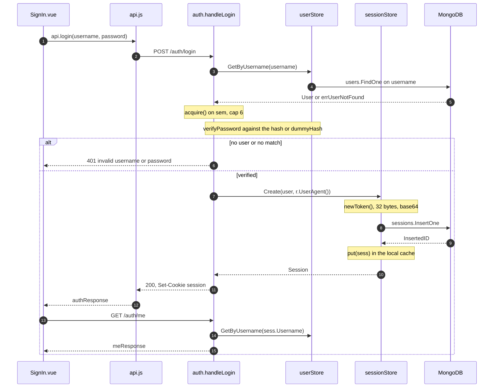

**Reading it**

- **`acquire() on sem, cap 6`.** It bounds concurrent argon2id hashes to `hashConcurrency = 6` with a
  `hashWaitTimeout` of 2 s, after which the answer is 503. The limit is per process, so
  two replicas on one host allow 12 hashes at 19 MB each.
- **`verifyPassword against the hash or dummyHash`.** An unknown username is verified against `a.dummyHash` rather than skipped, so a
  wrong username and a wrong password take the same time.
- **`newToken()` / `200, Set-Cookie session`.** The token is 32 random bytes, base64 `RawURLEncoding`. It goes into an
  `HttpOnly`, `SameSite=Lax` cookie and into the response body, for clients that prefer
  `Authorization: Bearer`. It never appears in `GET /auth/sessions`, which projects it
  away, and never travels the bus.
- **`put(sess) in the local cache`.** It writes to this instance's cache only. The other node learns nothing
  here — it reads the session from MongoDB the first time that token reaches it, then
  caches it for `cacheTTL = 10 min`.
- **`GET /auth/me`.** `handleMe` reads the *user*, not the session, so a display name changed in
  another tab is current rather than stale until the session expires.

**Based on:** `web/src/views/SignIn.vue`, `web/src/api.js`, `server/auth.go`, `server/password.go`, `server/users.go`, `server/sessions.go`

---

## seq-ws-connect.mmd

Opening the WebSocket: upgrade, session check, hub routing, the Redis subscription, and
the presence write.

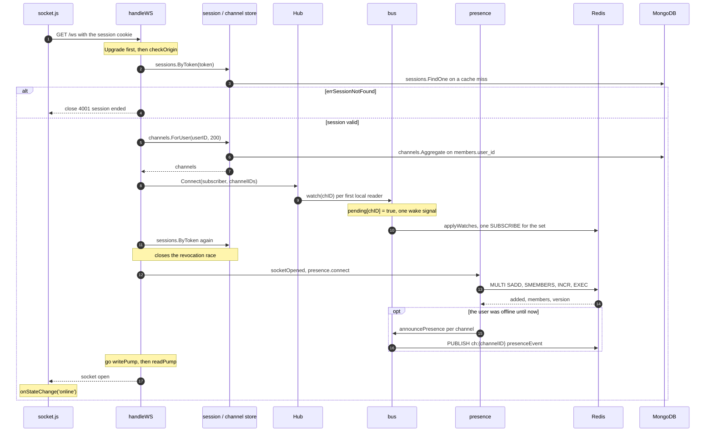

**Reading it**

- **`Upgrade first, then checkOrigin`.** The upgrade happens *before* the session check. Refused earlier, the answer is
  an HTTP 401 the browser hides from the page: the client sees close code 1006, the same
  as a network drop, and reconnects forever. Refused after, the client gets 4001 and stops.
- **`checkOrigin`.** It compares the `Origin` host against `r.Host`, plus anything in
  `WS_ALLOWED_ORIGINS` — needed only because `npm run dev` serves from port 5173 while the
  Vite proxy rewrites `Host` to 8080. A request with no `Origin` is allowed: only browsers
  send it, and only browsers attach cookies unprompted.
- **`channels.ForUser(userID, 200)`.** The socket subscribes to *all* of the user's channels at once, not one socket per
  channel. `channelsMaxLimit` is 200.
- **`watch(chID)` / `applyWatches`.** `watch` runs under the hub's mutex, so it must not block: it records the
  channel in `bus.pending` and pokes a one-slot `wake` channel. `bus.Run` then takes the
  whole set and issues one `SUBSCRIBE`, which turns a burst of a few hundred channels into
  a couple of round trips. A failed command is only logged — go-redis records the channels
  whatever the command returned and resubscribes them itself on reconnect.
- **`sessions.ByToken again`.** The second lookup closes a race: a revocation that landed between the first
  check and `Connect` would have found no socket to close. Revocation invalidates the
  cache before closing sockets, and this asks again only after the socket is in the hub,
  so one of the two always sees the other. It is almost always a cache hit.
- **`MULTI SADD, SMEMBERS, INCR, EXEC`.** `presence.connect` uses `MULTI`/`EXEC` so both indexes move together and the
  `SMEMBERS` reads the state the write produced.
- **`go writePump, then readPump`.** `writePump` is the only goroutine that writes to the socket — `gorilla/websocket`
  forbids concurrent writes. It also holds a timer on the session's `ExpiresAt` and
  re-reads the session when it fires, because expiry is otherwise invisible: the TTL index
  deletes the document without a word.

**Based on:** `web/src/socket.js`, `server/ws.go`, `server/hub.go`, `server/bus.go`, `server/presence.go`, `server/channels.go`, `server/sessions.go`

---

## seq-send-message-same-instance.mmd

Sending a message when both people hold a socket on the same instance.

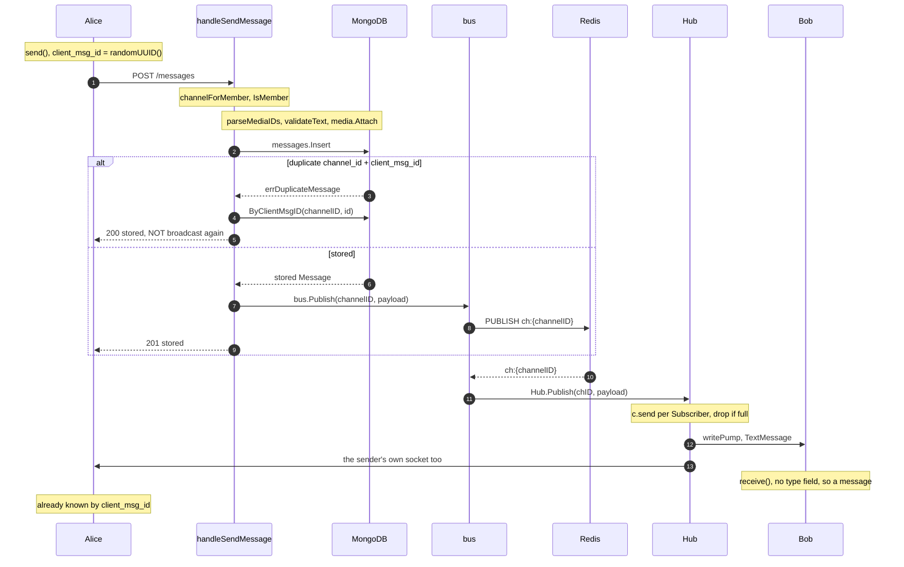

**Reading it**

- **The message still goes through Redis.** There is no local short-cut. `bus.Publish`
  is the only broadcast path, which means one message order on every node and no echo to
  filter out.
- **`messages.Insert` before `bus.Publish`.** Persist first, announce second. This is an invariant (`docs/architecture.md`), and it is
  what makes a lost bus event cost latency instead of data.
- **`errDuplicateMessage` / `ByClientMsgID(channelID, id)`.** `channel_id + client_msg_id` carries a unique partial index, so a retried POST
  hits a duplicate-key error, gets the stored message back with 200, and is **not**
  broadcast a second time. The client generates the id with `crypto.randomUUID()`.
  The channel is half of both the index and the lookup (#26): the id is the sender's own
  retry key, never a way to read a message out of a channel they are not in.
- **`c.send per Subscriber, drop if full`.** `Hub.Publish` does a non-blocking send into each `Subscriber.send` (buffer
  `sendBuffer = 256`) and drops any socket whose buffer is full. The drop exists because
  the hub holds one global mutex: a stuck reader would otherwise block every broadcast on
  the node.
- **`the sender's own socket too`.** It receives the message like everyone else's. The client
  finds it already in the feed by `client_msg_id` and ignores it.
- Attachments are bound to the channel *last*, once nothing else can refuse the message: a
  file bound to a channel with no message is harmless, a message pointing at files nobody
  may open is not.

**Based on:** `web/src/views/Messenger.vue` (`send`, `deliver`, `receive`), `server/messages_http.go`, `server/messages.go`, `server/bus.go`, `server/hub.go`

---

## seq-send-message-cross-instance.mmd

The same send when the two people are on different instances. The only difference is
which nodes hold a subscription to `ch:{channelID}`.

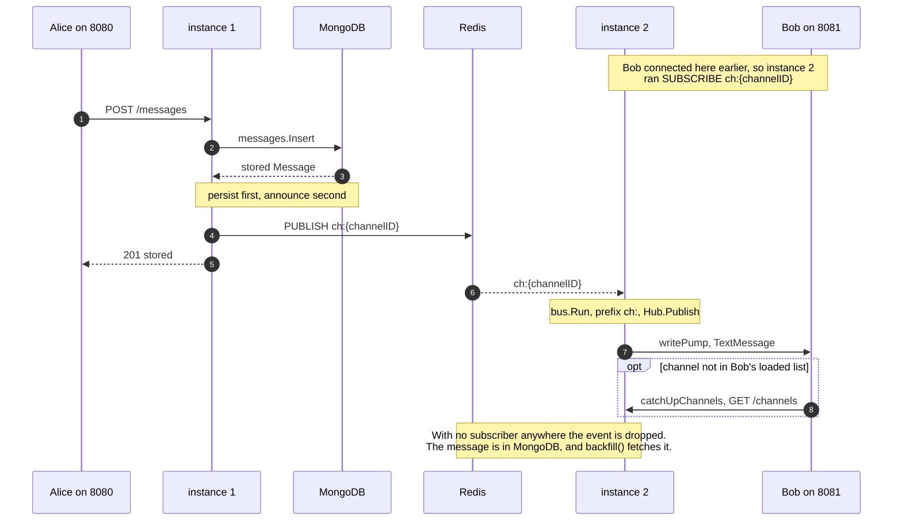

**Reading it**

- **The opening note.** Instance 2 subscribed when Bob's socket arrived there, not because of anything
  the sender did. No node knows where anyone else's sockets are — that is exactly why the
  `subscription` topic is global rather than addressed.
- **`bus.Run, prefix ch:, Hub.Publish`.** It routes by topic prefix: `ch:` goes to `Hub.Publish`, `session-revoked`
  to the revocation callback, `subscription` to `Hub.Subscribe` / `Unsubscribe`.
- **`catchUpChannels, GET /channels`.** The server can route a socket to a channel the client's list has never shown
  — a direct conversation the other side opened, or a join made in another tab.
  `catchUpChannels()` reloads the list, one request at a time so a burst does not fetch it
  once per message.
- **The closing note.** With no subscriber anywhere, Redis drops the event. Nothing is lost: the message
  is in MongoDB and `backfill()` fetches it on reconnect.
- There is no sticky-session problem to solve here, because no per-user state lives in the
  process. There is also no failover: `socket.js` reconnects to `location.host`, so a tab
  whose node dies retries that same port with 1–15 s backoff until it comes back.

**Based on:** `server/messages_http.go`, `server/bus.go`, `server/hub.go`, `server/ws.go`, `web/src/views/Messenger.vue`

---

## seq-load-history.mmd

Loading history: the first page, older pages on scroll, the originals that replies quote,
and the backfill after a reconnect.

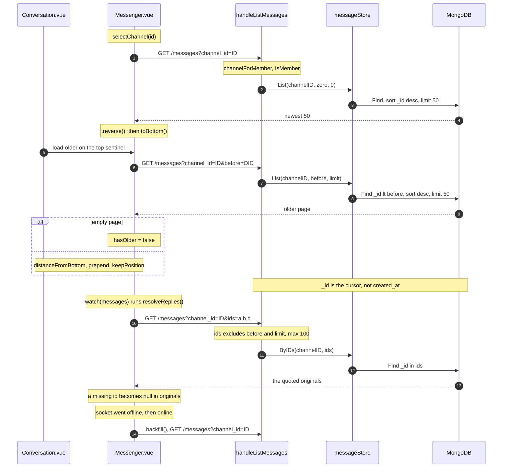

**Reading it**

- **`List(channelID, zero, 0)`.** The default page is `messagesPageSize = 50`, capped at `messagesMaxLimit = 100`,
  sorted `_id` descending. The client reverses it for the feed.
- **`Find _id lt before`.** The cursor is `_id`, not `created_at`. A measurement found up to 4173
  documents sharing one `created_at`, which makes it useless as a cursor.
  `_id` is an ObjectID, so it is time-ordered anyway, and the index `channel_id + _id`
  serves the descending sort as a backward scan with no `SORT` stage. There is no `skip`.
- **`GET /messages?channel_id=ID&ids=a,b,c`.** `ids` asks for particular messages rather than a page, so it refuses to be
  combined with `before` or `limit`. `listMessagesByID` uses `SplitN` with the limit plus
  one, so a query with a million commas is rejected without allocating a million strings.
- **`a missing id becomes null in originals`.** An id the server leaves out becomes `null` in `originals`, and the quote renders
  as unavailable. `findMessage(id)` walks up to 20 older pages when a quote's original is
  further back than the loaded window.
- **`backfill()`.** It runs on every offline→online transition. This is the mechanism
  that makes a lost Pub/Sub event harmless, so it belongs to the delivery guarantee, not
  to the UI.

**Based on:** `web/src/views/Messenger.vue` (`selectChannel`, `loadOlder`, `findMessage`, `resolveReplies`, `backfill`), `web/src/views/Conversation.vue`, `server/messages_http.go`, `server/messages.go`

---

## seq-revoke-session.mmd

Revoking a session from the device list — the `session-revoked` topic, and both directions
of `wireRevocation`.

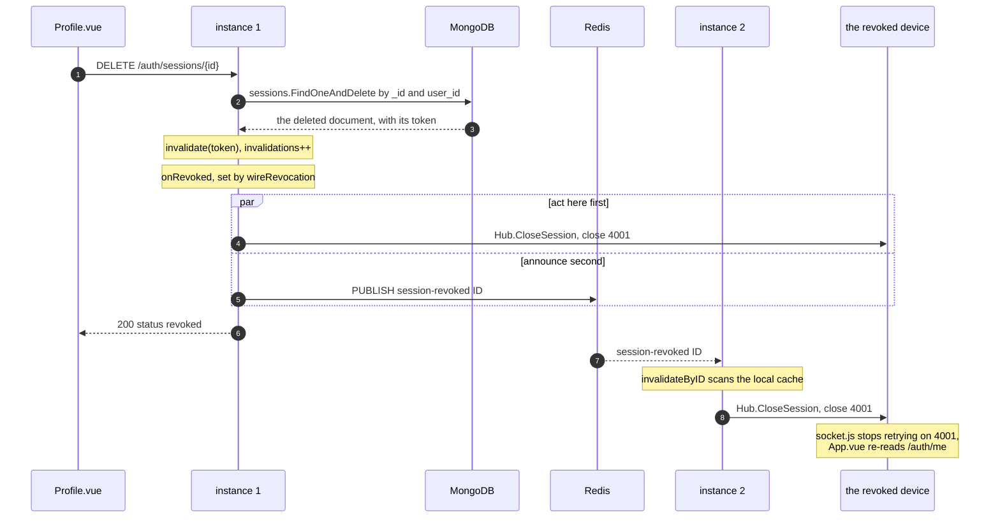

**Reading it**

- **`sessions.FindOneAndDelete by _id and user_id`.** `user_id` is part of the filter, so somebody else's session is simply not
  found rather than refused.
- **`the deleted document, with its token`.** It deletes by token but reads the document back, because the announcement
  carries the **id**, not the token. The token is the credential itself and has no business
  on the wire — Rocket.Chat keeps a hash of it for the same reason.
- **`invalidate(token), invalidations++`.** It bumps a counter as well as dropping the entry. A lookup notes the
  counter before querying and writes to the cache only if it has not moved, so a session
  deleted while an answer was in flight cannot be resurrected for `cacheTTL`.
- **The `par` block.** The revoking node acts first and announces second. With Redis down, revocation
  still works where it was asked for, and the other nodes catch up when their cache entry
  expires (at most 10 minutes).
- **`invalidateByID scans the local cache`.** It scans the cached sessions of that node, because the cache is
  keyed by token and the event carries an id. Revocations are rare, so this is cheaper
  than a second index kept in step on every login.
- **`Hub.CloseSession, close 4001`.** Invalidating the cache stops new requests; closing the sockets stops the ones
  already open, which authenticated once and would otherwise live on. A session can hold
  several sockets — every tab of a browser shares the cookie.
- The revoking node hearing its own event back changes nothing, which is why no filtering
  is needed.

**Based on:** `web/src/views/Profile.vue`, `server/users_http.go`, `server/sessions.go`, `server/main.go` (`wireRevocation`), `server/bus.go`, `server/hub.go`, `server/ws.go`

---

## seq-presence.mmd

Presence in three parts: a socket closing normally, a whole node dying and being swept,
and the REST lookup a client does on arrival.

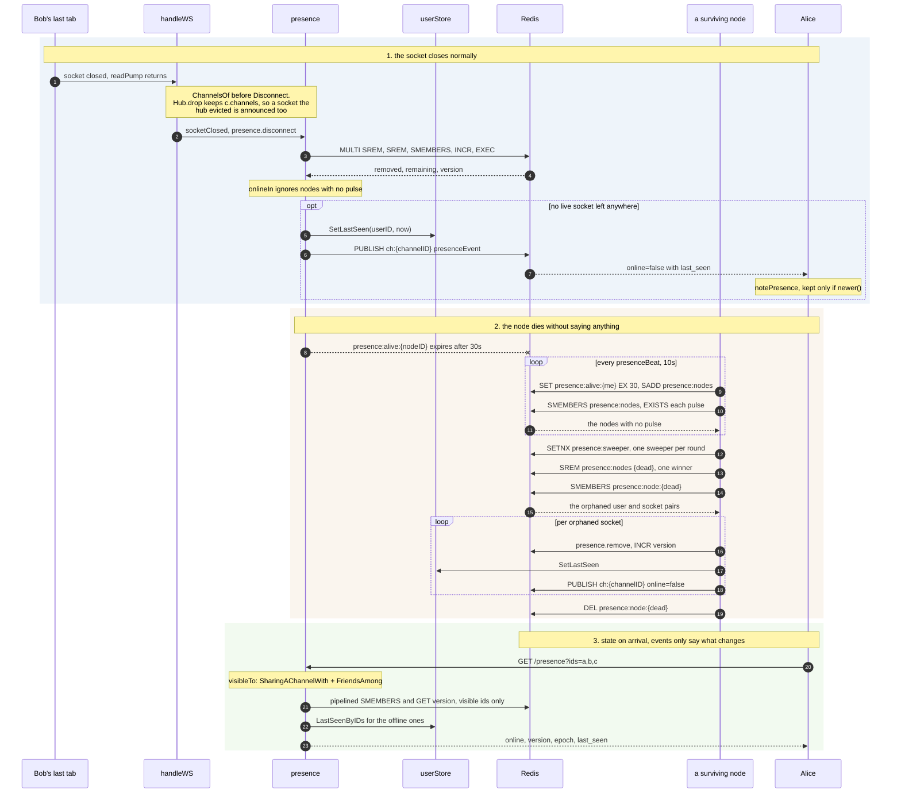

**Reading it**

- **`ChannelsOf before Disconnect`.** The channels are read *before* the hub forgets the socket, and the departure is
  announced *after* it is out of the hub, so the socket cannot hear about itself.
- **`Hub.drop keeps c.channels`.** It no longer clears `c.channels` (#25). It used to, and the hub drops a
  socket itself on a revoked session or a full send buffer — so by the time `handleWS`
  read the set it was empty and the offline event went to no channels at all. The user
  vanished from Redis and `last_seen_at` was written while everyone kept seeing them
  online until a reload. Clearing bought nothing: the subscriber is collected right after
  `handleWS` returns. `Reads` now answers `false` for a dropped socket, which it should
  have anyway — otherwise a typing frame could still leave a socket the hub had evicted.
- **`onlineIn ignores nodes with no pulse`.** It ignores sockets on nodes whose pulse has expired, so a read is correct
  the moment the pulse dies — no waiting for the sweep.
- **`SetLastSeen(userID, now)`.** `last_seen_at` is written only on the edge to offline. A second tab closing
  costs nothing, and a user who is online has no use for it. A failed write costs a stale
  "last seen", not the offline event, so it is only logged.
- **`notePresence, kept only if newer()`.** It keeps an event only if `newer(had, got)`: compare `epoch` first,
  then `version`. Events about one user come from different nodes and Pub/Sub keeps no
  order between publishers, so without this a stale "offline" could overwrite a fresh
  "online".
- **`SETNX presence:sweeper`.** One sweeper per round. The work is the same whoever does it, so doing it N
  times over would only race for the same claims. `presence:sweeper` expires by itself, so
  a node dying mid-sweep does not block the next round.
- **`SREM presence:nodes {dead}`.** This is the hand-off: Redis is single-threaded, so exactly one
  caller sees the entry actually disappear and owns the cleanup.
- **Not drawn:** `reregister()`. When `beat` reports this node was unknown — Redis
  restarted, or another node swept this one as merely slow — every local socket is
  registered again, so its people do not stay offline until they reload.
- **`GET /presence?ids=a,b,c`.** Events say only what *changes*, so state on arrival comes over REST. At most
  `presenceMaxIDs = 100` ids, asked for explicitly, as Mattermost's `/users/status/ids`
  does. `loadPresence()` runs on mount and on every reconnect.
- **`visibleTo` gates the answer** (#24). Online-ness and last-seen used to be readable by
  any logged-in account for any user id, and ids are not secret — search hands them out —
  so a hundred per request bought a running record of when a stranger sits at their
  computer. The boundary is the one already drawn for writing to a person: a channel in
  common, or friendship. Somebody outside it is **left out** of the answer rather than
  reported offline, since offline still confirms the account exists. Mattermost gates the
  profile and leaves status open; Revolt gates everything behind friendship or a shared
  server. This follows Revolt for state and Mattermost for the profile.
- **Known limit, stated in the commit:** a friend with no channel in common is answered by
  the REST snapshot but hears no live updates, because `announcePresence` publishes per
  channel and the bus has no channel to carry it on.
- Each node's `alive` map is a snapshot refreshed every 10 s, so two nodes can briefly
  disagree about whether a third is alive. `version` and `epoch` exist to let clients
  order the resulting events.

**Based on:** `server/ws.go`, `server/presence.go`, `server/presence_nodes.go`, `server/presence_http.go`, `server/users.go`, `web/src/views/Messenger.vue`

---

## seq-typing.mmd

Typing — the only frame a client may send over the socket, and the only flow here that
stores nothing at all.

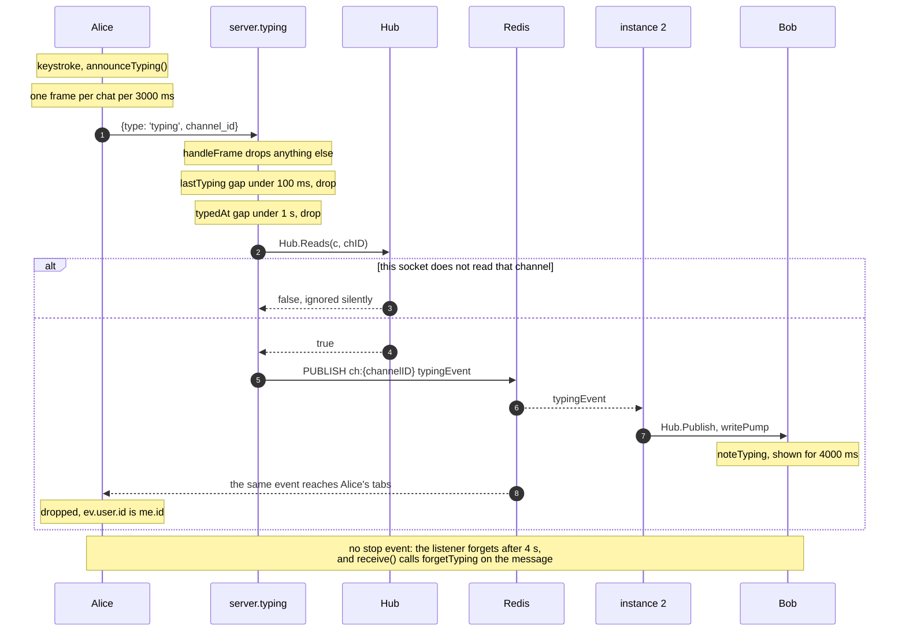

**Reading it**

- **Nothing is stored.** This is the flow that decided the bus: a MongoDB change stream
  can only carry what was written, and typing is worth something for a few seconds and
  never again.
- **`announceTyping()`.** Client side, it sends at most one frame per chat per
  `TYPING_REPEAT_MS = 3000`. After sending a message, `rearmTyping` pulls the next
  announcement forward — listeners forget a typist when their message arrives — but never
  closer than `TYPING_SERVER_GAP_MS = 1100`, because the server would drop it anyway.
- **`handleFrame drops anything else`.** It ignores anything that is not `type: 'typing'`, without an answer.
  Nobody is waiting for one, as with Revolt's `BeginTyping`. The read limit is 512 bytes.
- **`lastTyping gap under 100 ms`.** `typingMinGap` is checked first and takes no lock. Without it, a flood
  naming a new channel id in every frame would take the hub's global mutex in `Reads` —
  the mutex every broadcast on the node waits for. A dropped frame still moves
  `lastTyping`, so a flood stays dropped for as long as it lasts.
- **`typedAt gap under 1 s`.** `typingMinInterval` is per channel. Mattermost refuses to configure its own
  interval below one second for the same reason.
- **`Hub.Reads(c, chID)`.** Membership comes from the hub, not MongoDB: the socket is routed to exactly the
  channels its user is in, so asking costs a map lookup. It trails MongoDB by the time a
  `subscription` change takes to cross the bus, which is fine for typing and would not be
  for anything stored. Only a channel that passed the check is remembered in `typedAt`.
- **Both server limits are per connection**, not per user: `lastTyping` and `typedAt` live
  on `Subscriber`. Three tabs, possibly on three nodes, can each emit at the full rate.
  Harmless — the client keys typists by user id — but "one frame per second per channel"
  is per socket.
- **The closing note.** No "stopped typing" event exists. A listener forgets the typist after
  `TYPING_SHOWN_MS = 4000`, a little later than the next repeat would arrive, and a
  message from the typist clears it at once. Telegram uses 5 s and 6 s but also sends an
  explicit cancel.

**Based on:** `web/src/views/Messenger.vue` (`announceTyping`, `noteTyping`, `rearmTyping`), `web/src/socket.js`, `server/ws.go`, `server/typing.go`, `server/hub.go`, `server/bus.go`
